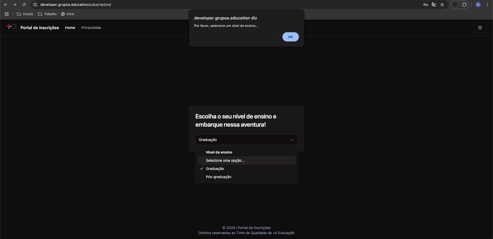
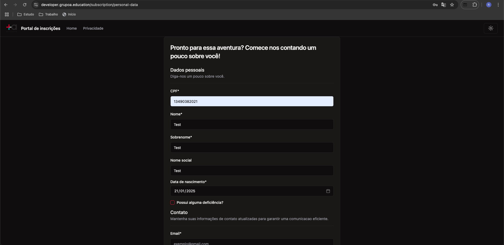
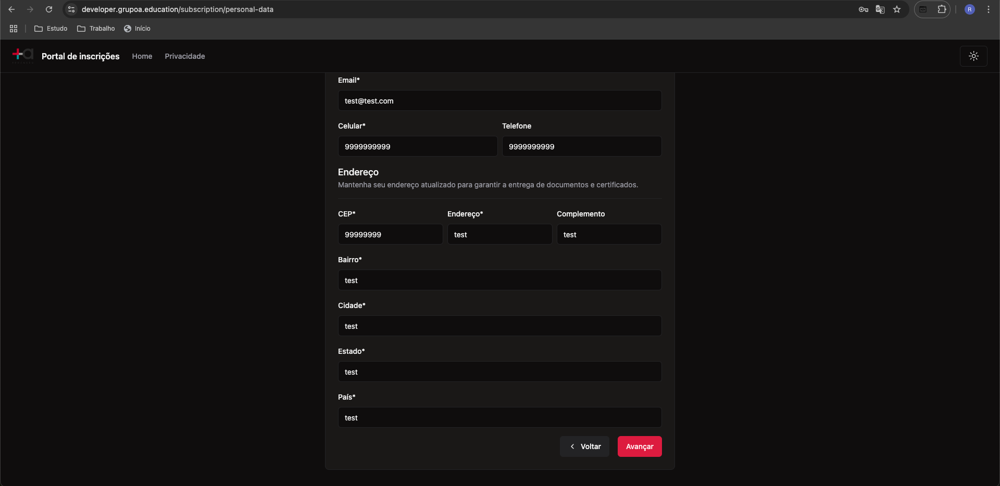
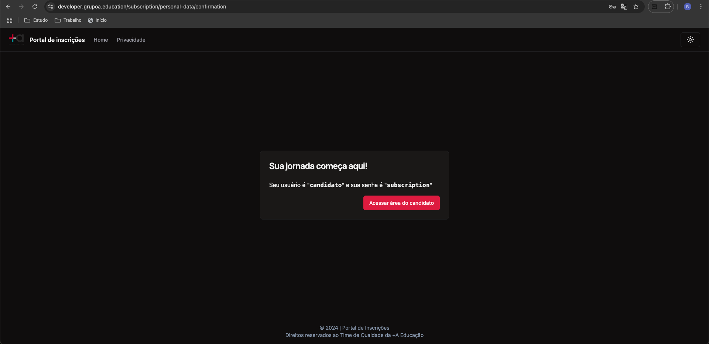
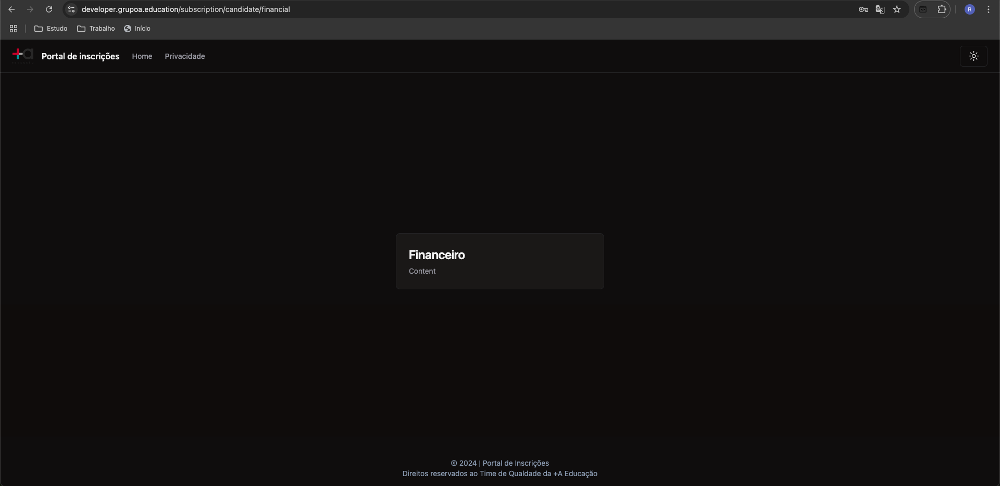
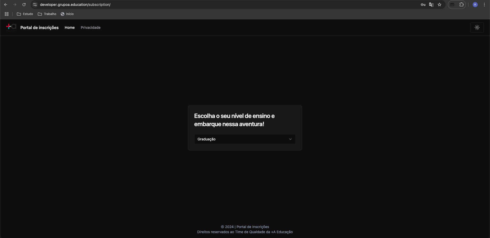

# Bug Report

- [BUG01 - Seleção de nível de ensino](#bug01)
- [BUG02 - Seleção no campo nível de ensino "Selecione uma opção..."](#bug02)
- [BUG03 - Formulário não possui validações de dados](#bug03)
- [BUG04 - Problema ao clicar em Financeiro na área logada](#bug04)

### BUG01 - Seleção de nível de ensino

#### Descrição do Problema

Ao selecionar um nível de ensino "Graduação" ou "Pós-graduação" e clicar no botão voltar, quando tento novamente permanecer com o mesmo nível selecionado anteriormente não está permitindo.

#### Ambiente

- Navegador/Versão: Chrome
- URL do ambiente: https://developer.grupoa.education/subscription/

#### Passos para Reproduzir o Problema

- Acessar o site https://developer.grupoa.education/subscription/
- Clique no para selecionar um nível de ensino
- Clique em voltar
- Tentar avançar com nível de ensino já selecionado anteriormente

#### Resultado Esperado

- Permitir a seleção do nível de ensino.

#### Resultado Observado

- O sistema não permite avançar com a opção que havia selecionado anteriormente.

#### Evidência(s)

{width=65%}

### BUG02 - Seleção no campo nível de ensino "Selecione uma opção..."

#### Descrição do Problema

Opção desnecessária na seleção do campo nível de ensino: "Selecione uma opção..."

#### Ambiente

- Navegador/Versão: Chrome
- URL do ambiente: https://developer.grupoa.education/subscription/

#### Passos para Reproduzir o Problema

- Acessar o site https://developer.grupoa.education/subscription/
- Clique no para selecionar um nível de ensino
- Clique em "Selecione uma opção..."

#### Resultado Esperado

- Acredito que não seja uma opção válida

#### Resultado Observado

- O sistema retorna a mensagem "Por favor, selecione um nível de ensino..."

#### Evidência(s)

{width=65%}

### BUG03 - Formulário não possui validações de dados

#### Descrição do Problema

Ao preencher o formulário identifiquei que não valida os dados inseridos e permite avançar.

#### Ambiente

- Navegador/Versão: Chrome
- URL do ambiente: https://developer.grupoa.education/subscription/

#### Passos para Reproduzir o Problema

- Acessar o site https://developer.grupoa.education/subscription/
- Clique no para selecionar um nível de ensino
- Clique em "Selecione um curso..."
- Clique no botão Avançar
- Preencher o formulário

#### Resultado Esperado

- Validação nas informações inseridas, como exemplo os campos: Data Nascimento e Endereço.

#### Resultado Observado

- O sistema permite avançar com data nascimento dia atual e não valida as informações de endereço 

#### Evidência(s)

{width=65%}
{width=65%}
{width=65%}

### BUG04 - Problema ao clicar em Financeiro na área logada

#### Descrição do Problema

Após efetuar login na plataforma e clicar na opção Financeiro é exibida uma tela, porém não permite retornar a área logada, ao clicar em home por exemplo, retorna a primeira tela para iniciar um novo cadastro.

#### Ambiente

- Navegador/Versão: Chrome
- URL do ambiente: https://developer.grupoa.education/subscription/

#### Passos para Reproduzir o Problema

- Acessar o site https://developer.grupoa.education/subscription/
- Clique no para selecionar um nível de ensino
- Clique em "Selecione um curso..."
- Clique no botão Avançar
- Preencher o formulário
- Clicar em Acessar área do candidato
- Preencher os campos usuário=candidato senha=subscription
- Clicar no botão login
- Clicar na opção Financeiro 

#### Resultado Esperado

- Ao acessar a tela financeiro e clicar na opção home deveria retornar a tela inicial da área do candidato

#### Resultado Observado

- Ao acessar a tela Financeiro e clicar em Home volta a primeira tela para cadastro não permitindo retornar a área logada. 

#### Evidência(s)

{width=65%}
{width=65%}
